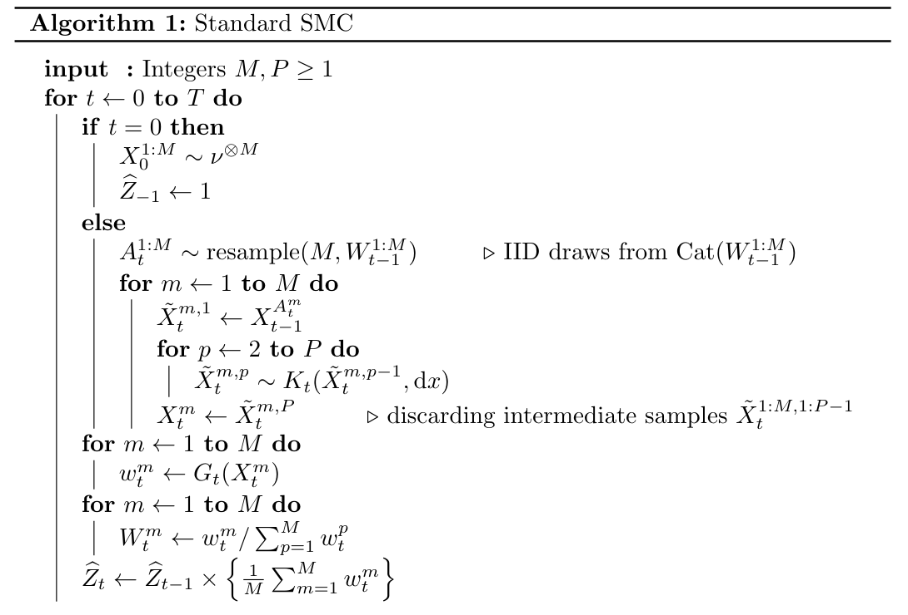
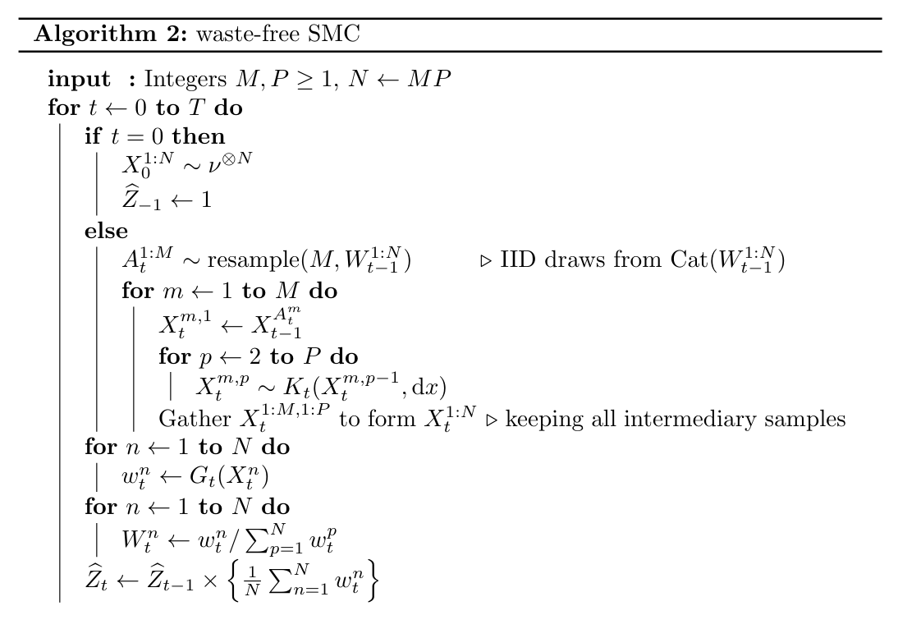
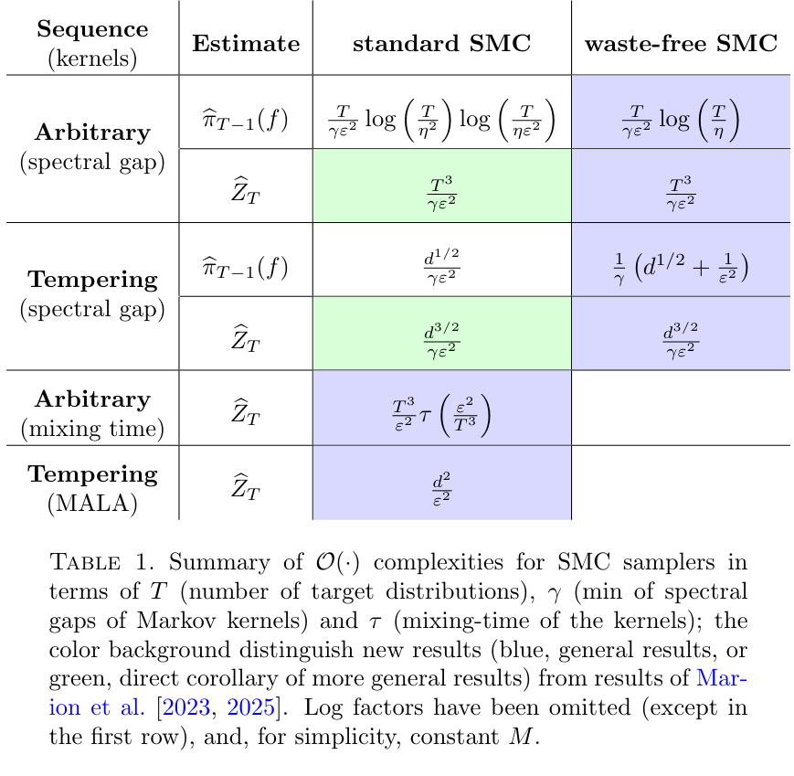
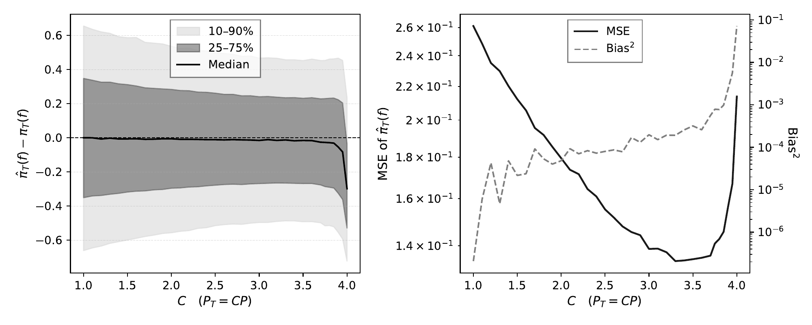

## SMC Samplers

SMC samplers approximate a sequence of distributions $\pi_0, \ldots, \pi_T$ by combining importance sampling, resampling and MCMC.

Two main use-cases:

- **Natural sequence**: e.g. Bayesian online learning, where $\pi_t$ is the posterior given the $t$ first data points.
- **Artificial sequence**: designed to interpolate between an easy $\pi_0$ and a hard target $\pi_T = \pi$. A popular choice is **geometric tempering**:
$$\pi_t \propto q^{1-\lambda_t} \pi^{\lambda_t}, \quad \lambda_t \nearrow 1.$$

Key feature: SMC provides an estimate of the normalising constants $Z_t = \nu(g_t)$.

## Notations

Consider a generic sequence of probability distributions:
$$\pi_t(\mathrm{d}x) = \frac{1}{\nu(g_t)} g_t(x) \nu(\mathrm{d}x),$$
where $\nu$ is a probability distribution.
The reweighting functions are given by:
$$G_t = \frac{g_t}{g_{t-1}}, \qquad G_0 = g_0.$$

We let $(K_t)$ be the sequence of Markov kernels used to move particles at each iteration.

## Standard SMC

:::: {.columns}

::: {.column width="42%"}

**Cost:** $N = MP$ Markov transitions at each iteration $t$.

**Standard SMC** (Algorithm 1):

- Run $M$ chains of length $P$.
- Keep only the **end-points** $X^{m,P}_t$.
- Reweight and resample the $M$ end-points.

Only $M$ of the $N = MP$ simulated states survive — the intermediate states are **wasted**.

:::

::: {.column width="58%"}

{fig-align="center"}

:::

::::

## Waste-Free SMC

:::: {.columns}

::: {.column width="42%"}

**Same cost** $N = MP$ Markov transitions per iteration.

**Difference:** instead of discarding the intermediate states, **keep all $N = MP$ of them**.

**Waste-Free SMC** (Algorithm 2, Dau & Chopin 2021):

- Run $M$ chains of length $P$, keep **all $N = MP$ states**.
- Reweight all $N$ states; resample $M$ chain start-points from them.

Nothing is wasted — the same budget yields $N$ usable states per iteration.

:::

::: {.column width="58%"}

{fig-align="center"}

:::

::::

## Goal 1: Moment Estimation

We want to estimate $\pi_{T-1}(f) = \int f \, \mathrm{d}\pi_{T-1}$ for a bounded test function $f$.

**Estimators:**

- Standard SMC: $\hat\pi_{T-1}(f) = M^{-1}\sum_{m=1}^M f(X^m_T)$
- Waste-Free SMC: $\hat\pi_{T-1}(f) = N^{-1}\sum_{m=1}^M\sum_{p=1}^P f(X^{m,p}_T)$

**Goal:** find conditions on $M$ and $P$ ensuring
$$\Pr\!\left(|\hat\pi_{T-1}(f) - \pi_{T-1}(f)| < \varepsilon\right) \geq 1 - \eta.$$

## Goal 2: Normalising Constant Estimation

SMC provides an unbiased estimate of each ratio $Z_t/Z_{t-1} = \pi_{t-1}(G_t)$, and therefore:
$$\hat Z_T = \prod_{t=0}^T \widehat{\frac{Z_t}{Z_{t-1}}},\qquad \text{with } \widehat{\frac{Z_t}{Z_{t-1}}} = \hat{\pi}_{t-1}(G_t),$$
is an unbiased estimate of $Z_T$.

**Goal:** find conditions on $M$ and $P$ ensuring
$$\Pr\!\left(\left|\frac{\hat Z_T}{Z_T} - 1\right| < \varepsilon\right) \geq 1 - \eta.$$

**Challenge (1):** $\hat Z_T$ is a product of $T$ terms — small relative errors compound multiplicatively.

**Challenge (2):** $\frac{G_t}{\pi_{t-1}(G_t)}$ can be unbounded, exponentially large in $d$ even under bounded $\chi^2$ assumption.

## Assumptions

**Assumption A1.** $K_t$ leaves $\pi_{t-1}$ invariant for all $t$.

**Assumption A2.** Each $K_t$ admits a spectral gap $\gamma_t > 0$; let $\gamma = \min_t \gamma_t$.

- Mixing time: $\tau(\xi,\mu,K)=\min\{n : \text{TV}(\mu K^n,\pi)\le \xi\} \leq \frac{1}{\gamma} \log\!\left(\frac{\omega}{\xi}\right)$,
assuming $\mu \ll \pi$ with $\omega \geq \sup_x \frac{\mathrm{d}\mu}{\mathrm{d}\pi}(x)$.

**Assumption A3.** $\chi^2(\pi_t \mid \pi_{t-1}) \leq 1$ for all $t$.

## Known Result: Marion et al. (2023/2025)

**Theorem.** Under A1, A3, and a mixing time assumption: taking
$M \geq \Omega(\log(T\eta^{-2})\varepsilon^{-2})$ and $P \geq \Omega\left(\tau\!\left(\frac{\eta}{MT}\right)\right)$
ensures
$$\Pr\!\left(|\hat\pi_{T-1}(f) - \pi_{T-1}(f)| < \varepsilon\right) \geq 1 - \eta.$$

**Query complexity:**
Under the spectral gap assumption A2, this implies the complexity
$$O\!\left(\frac{T}{\gamma\varepsilon^2} \log\frac{T}{\eta^2} \log\!\left(\frac{T}{\eta\varepsilon^2} \log\frac{T}{\eta^2}\right)\right).$$

## Old and new results

{fig-align="center" width=60%}

## Moment Estimates: Waste-Free SMC

**Theorem 3.1.** Under A1, A2, A3. Fix $M \geq 1$. For some constant $C$, taking
$$P \geq \frac{C}{\gamma}\max\!\left\{\log\frac{MT}{\eta},\quad \frac{1}{\varepsilon^2}\log\frac{T}{\eta}\right\}$$
ensures that $\hat\pi_{T-1}(f) = N^{-1}\sum_{m,p} f(X^{m,p}_T)$ satisfies
$$\Pr\!\left(|\hat\pi_{T-1}(f) - \pi_{T-1}(f)| < \varepsilon\right) \geq 1 - \eta.$$

| Standard SMC | Waste-Free SMC | [Greedy WF-SMC]{.fragment} |
|:---|:---|:---|
| $O\!\left(\frac{T}{\gamma\varepsilon^2} \log\frac{T}{\eta^2} \log\!\left(\frac{T}{\eta\varepsilon^2}\log\frac{T}{\eta^2}\right)\right)$ | ${\color{green}{O\!\left(\frac{T}{\gamma\varepsilon^2}\log\frac{T}{\eta}\right)}}$ | [${\color{green}{O\!\left(\frac{T}{\gamma}\log\frac{T}{\eta} + \frac{1}{\gamma\varepsilon^2}\log\frac{T}{\eta}\right)}}$]{.fragment} |

## Moment Estimates: Greedy Waste-Free SMC

Allow $P_t$ to vary across iterations.

**Theorem 3.2.** For some constant $C$, the same guarantee holds as soon as:
$$P_{0:T-1} \geq \frac{C}{\gamma}\log\frac{MT}{\eta}, \qquad P_T \geq \frac{C}{\gamma\varepsilon^2}\log\frac{T}{\eta}.$$

**Resulting complexity** ($M \leq O(1)$):
$$O\!\left(\frac{T}{\gamma}\log\frac{T}{\eta} + \frac{1}{\gamma\varepsilon^2}\log\frac{T}{\eta}\right).$$

::: callout-important
Only $P_T$ needs to scale as $\varepsilon^{-2}$. In the $\varepsilon \ll 1$ regime, the leading term is **logarithmic** in $T$.
:::

## Normalising Constants: Challenge

**Key difficulty:** Previous Gaussian concentration requires uniform bounds on the normalised reweighting functions $G_t/\pi_{t-1}(G_t)$
which can be **exponentially large** in $d$ even under A3.

**Solution:** use second moment approach instead of Gaussian concentration, since this is aligned with the relative variance assumption on $G_t$.

## Normalising Constants: First Bounds

**Theorem 3.3** (WF-SMC). Under A2 + A3, $M \leq O(1)$, $P \geq \Omega( T^3 / (\gamma\varepsilon^2))$:
$$\Pr\!\left(|\hat Z_T / Z_T - 1| < \varepsilon\right) \geq 3/4, \qquad \text{cost } O\!\left(\frac{T^4}{\gamma\varepsilon^2}\right).$$

**Theorem 6.1** (Standard SMC, mixing times only). $M \geq \Omega(T^3/\varepsilon^2)$, $P \geq \Omega(\tau(1/(MT)))$:
$$\Pr\!\left(|\hat Z_T / Z_T - 1| < \varepsilon\right) \geq 3/4, \qquad \text{cost } O\!\left(\frac{T^4}{\varepsilon^2}\,\tau\!\left(\frac{\varepsilon^2}{T^4}\right)\right).$$

## Normalising Constants: Product-of-Medians

Run $J = \Theta(\log(T/\eta))$ independent copies; take the median at each step:
$$\hat Z_T^{\mathrm{med}} = \prod_{t=0}^T \mathrm{median}_j\!\left\{\hat\pi_{t-1}^{(j)}(G_t)\right\}.$$

**Theorem 3.5** (WF-SMC). $M \leq O(1)$, $P \geq \Omega(T^2 / (\gamma\varepsilon^2))$:
$$\Pr\!\left(|\hat Z_T^{\mathrm{med}} / Z_T - 1| < \varepsilon\right) \geq 1 - \eta, \qquad \text{cost } O\!\left(\frac{T^3}{\gamma\varepsilon^2}\log\frac{T}{\eta}\right).$$

**Theorem 6.2** (Standard SMC, mixing times only). $M \geq \Omega(T^2/\varepsilon^2)$, $P \geq \Omega(\tau(1/(MT)))$:
$$\Pr\!\left(|\hat Z_T^{\mathrm{med}} / Z_T - 1| < \varepsilon\right) \geq 1 - \eta, \qquad \text{cost } O\!\left(\frac{T^3}{\varepsilon^2}\,\tau\!\left(\frac{\varepsilon^2}{T^3}\right)\log\frac{T}{\eta}\right).$$

## Tempering: Bounding $\chi^2$

**Assumption A4.** $q \propto e^{-Q}$, $\pi \propto e^{-U}$, $V = U - Q$ satisfies:
$$\nabla^2(Q + \lambda V) \succeq (\alpha_Q + \lambda\alpha_V)I \succ 0 , \qquad \nabla^2 V \preceq \beta_V I.$$

**Theorem 5.1.** Under A4, the tempering sequence of length
$$T =  \Theta\left( \kappa_V \sqrt{d}\log\left(1+\frac{\alpha_V}{c\alpha_Q}\right)\right), \quad \kappa_V = \beta_V / \alpha_V,$$
given by
$$\lambda_t = 1 \wedge \left[
                                 \frac{c\alpha_Q}{\alpha_V}\left\{\left(1+\frac{1}{\kappa_V
            \sqrt{d}}\right)^{t+1}-1\right\}\right]$$
for some $c>0$ is such that $\chi^2(\pi_t \mid \pi_{t-1}) \leq 1$ for all $t$.

## Tempering within waste-free SMC

Under A2 + A4 with $T = \Theta(\kappa_V\sqrt{d})$:

| Estimate | Algorithm | Complexity |
|:---|:---|:---|
| $\hat\pi(f)$ | Greedy WF-SMC  | $\frac{1}{\gamma}\log\!\left(\kappa_V\sqrt{d}\right)\!\left(\kappa_V\sqrt{d} + \frac{1}{\varepsilon^2}\right)$ |
| $\hat\pi(f)$ | Waste-free SMC | $\frac{\kappa_V\sqrt{d}}{\gamma\varepsilon^2}\log\!\left(\kappa_V\sqrt{d}\right)$ |
| $\hat Z_T$ |  Waste-free SMC | $\frac{d^2\kappa_V^4}{\gamma\varepsilon^2}$ |
| $\hat Z_T$ |  // Medians | $\frac{d^{3/2}\kappa_V^3}{\gamma\varepsilon^2}\log\!\left(\kappa_V\sqrt{d}\right)$ |

Log factors involving $1/\eta$ omitted.

## Normalising Constants: RWM vs MALA

| Algorithm | $\widehat{Z}_T$ | $\widehat{Z}_T^{\mathrm{med}}$ |
|:---|:---|:---|
| WF-SMC (RWMH) | $d^3 \kappa^5 \varepsilon^{-2}$ | $d^{5/2} \kappa^4 \varepsilon^{-2}$ |
| SMC (MALA) | $d^{5/2} \kappa^5 \varepsilon^{-2}$ | $d^2 \kappa^4 \varepsilon^{-2}$ |

Log factors omitted; fixed failure probability $\eta \leq 1/4$.

## Practical Recommendations

::: callout-important
## For moments of $\pi_{T-1}$

Use **Greedy WF-SMC**. Set $P_t$ relative to the mixing time at step $t$ (e.g. via autocorrelation); only $P_T$ needs to scale as $\varepsilon^{-2}$.

Set $M$ small (e.g. equal to the number of parallel nodes). Use relative ESS $\geq N/2$ to calibrate the tempering schedule, yielding $T = \Theta(\sqrt{d})$.
:::

::: callout-important
## For normalising constants

Keep $P$ fixed across iterations.
 Regarding which estimators
    to use, $\hat{Z}^{\mathrm{med}}_T$ or $\hat{Z}_T$:
    $\hat{Z}_T$ is unbiased, which allows for averaging over batches,
     while $\hat{Z}^{\mathrm{med}}_T$ is not but might be
    more robust to heavy-tailed reweighting functions.
:::

## Robust estimation of $Z$: $\hat{Z}_T$ vs $\hat{Z}^{\mathrm{med}}_T$

{fig-align="center" width=50%}

## Greedy WF-SMC: Allocating Budget to the Last Iteration

For moments of $\pi_{T-1}$, only $P_T$ must scale as $\varepsilon^{-2}$. We run **greedy WF-SMC** under a fixed budget $P_T + (T-1)P = \text{cst}$, with $P_T = C P$ ($C = 1$ recovers plain WF-SMC).

:::: {.columns}

::: {.column width="55%"}

- Target $\pi_T = \tfrac12\mathcal{N}(-(2,2)^\top, I_2) + \tfrac12\mathcal{N}((3,3)^\top, I_2)$, starting from $\nu = \mathcal{N}(0_2, I_2)$, geometric tempering, RWM kernels.
- Each point: $4\times 10^4$ independent runs.

- Taking $C > 1$ **reduces error**: shifting budget to the final iteration helps.
- But too large $C$ yields $P_t$ to be below the mixing time, and the bias **blows up** (typically mode collapse).

:::

::: {.column width="45%"}

{fig-align="center"}

:::

::::

::: callout-important
Allocate more budget to $P_T$, but keep $P_t$ ($t<T$) of order the mixing time of $K_t$.
:::

## References

Marion, Joe, Mathews, Joseph, and Schmidler, Scott C.
*Finite Sample Bounds for Sequential Monte Carlo and Adaptive Path Selection Using the $L_2$ Norm*, 2025.

Marion, Joe, Mathews, Joseph, and Schmidler, Scott C.
*Finite-sample complexity of sequential Monte Carlo estimators*, 2023.

Dau, Hai-Dang and Chopin, Nicolas.
*Waste-free sequential Monte Carlo*, JRSS-B, 2021.
